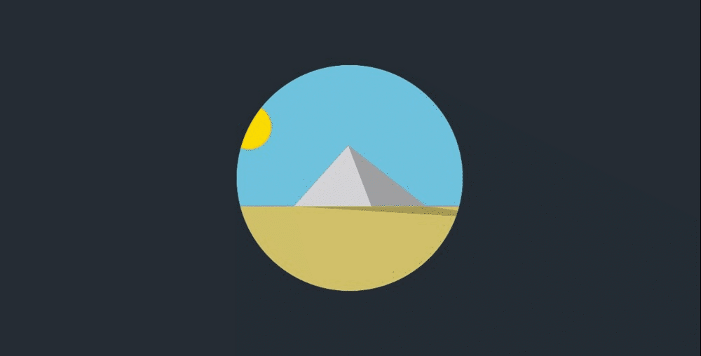

# Pyramid Scene

Welcome to Day 003 of my 100 Days CSS Challenge! Today's challenge involves creating a captivating pyramid scene using HTML and CSS. Let's explore the details of this visually intriguing design.

## Table of Contents

- [Description](#description)
- [Demo](#demo)
- [Features](#features)
- [Technologies Used](#technologies-used)
- [Implementation Details](#implementation-details)
- [Challenges Faced](#challenges-faced)
- [Further Improvements](#further-improvements)
- [Contributing](#contributing)

## Description

This project showcases a animation scene created using HTML and CSS. The scene consists of a dynamic sky, sun, ground, and pyramid that animate continuously.

## Demo

## Features

- Smooth animations for a visually engaging experience.
- Creative use of CSS properties to create a dynamic scene.

## Technologies Used

- HTML5
- CSS3

## Implementation Details

- The pyramid scene is crafted using HTML and CSS.
- CSS animations are used to achieve changing colors in the sky, an oscillating sun, shifting sand, and shading on the pyramid sides.
- `clip-path` is employed to create the unique shapes of the pyramid's sides and the shadow.

## Challenges Faced

During the development of this snippet, I encountered challenges in fine-tuning the timing of animations to achieve a harmonious and realistic scene.

## Further Improvements

- Experiment with additional details to enhance the realism of the desert scene.
- Implement interactive elements to engage users with the animation.
- Optimize the animation timings and transitions for a smoother visual experience.

## Contributing

Contributions are welcome! If you find any issues or have suggestions for improvements, feel free to open an issue or create a pull request.

Stay tuned for Day 004 as I continue this creative journey of the 100 Days CSS Challenge! 🎨🚀

[Repository Link](https://github.com/Adhamxiii/100-days-css-challenge)