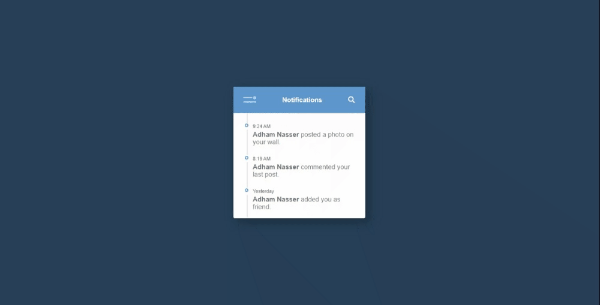

# Notification Panel

Welcome to Day 007 of my 100 Days CSS Challenge! In this project, I've created an interactive notification panel using HTML, CSS, and JavaScript. Let's explore the details of this dynamic notification system.

## Table of Contents

- [Description](#description)
- [Demo](#demo)
- [Features](#features)
- [Technologies Used](#technologies-used)
- [Implementation Details](#implementation-details)
- [Usage](#usage)
- [Contributing](#contributing)

## Description

This project showcases an interactive notification panel where users can see recent notifications. The panel includes a header with a menu button and a search icon. Notifications are displayed with timestamps, names, and subtitles. The panel also has a sub-menu for navigation options.

## Demo

## Features

- Interactive menu button that toggles a sub-menu for navigation.
- Search icon that reveals a search input field.
- Notifications with timestamps, names, and subtitles.
- Smooth animations for a dynamic user experience.

## Technologies Used

- HTML5
- CSS3
- JavaScript (for toggle functionality)

## Implementation Details

- The notification panel is crafted using HTML and CSS.
- JavaScript is used for toggling the search input field and sub-menu.
- CSS animations are applied to enhance the visual appeal and interactivity.

## Usage

To see the interactive notification panel in action, simply open the HTML file in a web browser. Click on the menu button to reveal the sub-menu, and click on the search icon to show the search input field. Notifications are displayed with timestamps, names, and subtitles.

## Contributing

Contributions are welcome! If you encounter any issues or have suggestions for improvements, feel free to open an issue or create a pull request.

Stay tuned for Day 008 as I continue my creative journey through the 100 Days CSS Challenge! 🎨🚀

[Repository Link](https://github.com/Adhamxiii/100-days-css-challenge)
