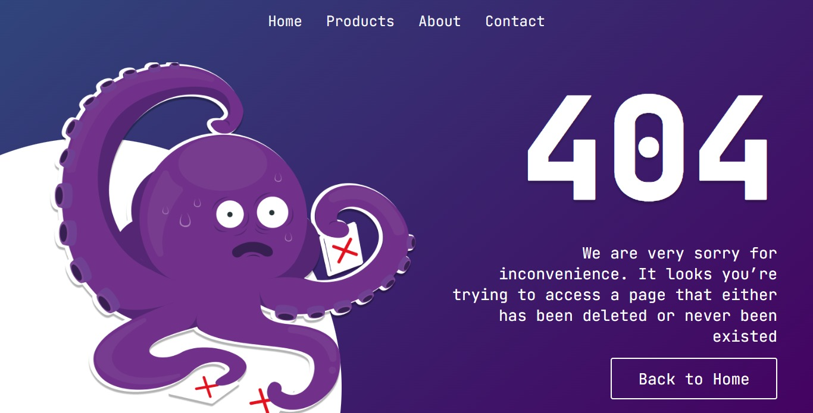

# 404 Page

Welcome to Day 008 of my 100 Days CSS Challenge! In today's challenge, I've created a captivating 404 error page using HTML and CSS. This page is designed to be displayed when a user attempts to access a non-existent or deleted page on a website. Let's delve into the details of this visually engaging 404 error page.

## Table of Contents

- [Description](#description)
- [Demo](#demo)
- [Features](#features)
- [Technologies Used](#technologies-used)
- [Implementation Details](#implementation-details)
- [Responsive Design](#responsive-design)
- [Contributing](#contributing)
- [Credit](#credit)

## Description

This project showcases a beautifully designed 404 error page with a unique layout and visual elements. The page consists of a header navigation bar, an image section on the left, and a content section on the right.

## Demo

## Features

- Customized navigation menu with links to essential sections.
- Visually appealing circular element on the left side.
- Large and prominent "404" text for easy identification of the error.
- Informative and empathetic error message.
- Stylish "Back to Home" button for quick navigation.

## Technologies Used

- HTML5
- CSS3
- JetBrains Mono font

## Implementation Details

- The header includes a navigation bar with links to Home, Products, About, and Contact sections.
- The circular element on the left is created using a combination of CSS properties and the `clip-path` property.
- The image is displayed on the left side and is styled to fit within the circular element.
- The "404" text and the error message are positioned on the right side.
- The "Back to Home" button is styled with a border, background, and appropriate text color.

## Responsive Design

The page is responsive and adjusts its layout for different screen sizes. On smaller screens, the circular element and image take up the full width, and the content is stacked vertically for improved readability.

## Contributing

Contributions are welcome! If you have suggestions for improvements or find any issues, feel free to open an issue or create a pull request.

## Credit

The design was inspired by [Thayna Karolina](https://www.figma.com/community/file/1194461293213787838/Daily-UI-%23008---404-Page)'s creative talent and dedication to the challenge.

Thank you for joining me on Day 008 of the 100 Days CSS Challenge! Stay tuned for more creative designs in the days to come.

[Repository Link](https://github.com/Adhamxiii/100-days-css-challenge)

