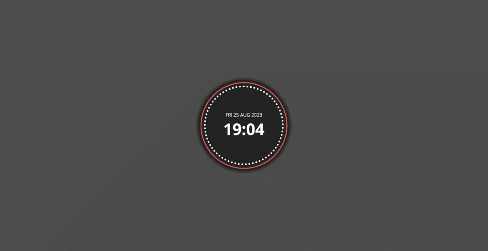

# Clock ⏰

Welcome to Day 009 of my 100 Days CSS Challenge! In this challenge, I've created an interactive clock using HTML, CSS, and JavaScript. This clock features a rotating spinner, dotted border, and displays the current time and date.

## Table of Contents

- [Clock ⏰](#clock-)
  - [Table of Contents](#table-of-contents)
  - [Preview](#preview)
  - [Description](#description)
  - [Technologies Used](#technologies-used)
  - [Features](#features)
  - [Live Demo](#live-demo)
  - [Credits](#credits)

## Preview

## Description

For Day 009 of the challenge, I've designed an engaging clock that showcases the current time and date. The clock includes the following features:

- A rotating spinner that adds visual interest to the design.
- Dotted border for a unique and attractive appearance.
- Current time displayed in hours and minutes.
- Current date displayed with the day of the week, day of the month, month name, and year.

The clock design combines HTML, CSS, and JavaScript to create a dynamic and visually appealing user experience.

## Technologies Used

- HTML
- CSS
- JavaScript

## Features

- Real-time updating of time and date.
- Animated spinner to enhance visual appeal.
- Stylish presentation with dotted border.

## Live Demo

You can see the live demo of the Clock challenge by clicking [here](https://tick-tock-haven.vercel.app/).

## Credits

- Design and code by [Adham Nasser](https://github.com/Adhamxiii)
- Spinner animation inspired by creative designs online.

Feel free to explore the code and customize the clock to your liking! Stay tuned for more exciting challenges as I continue the 100 Days CSS Challenge.
